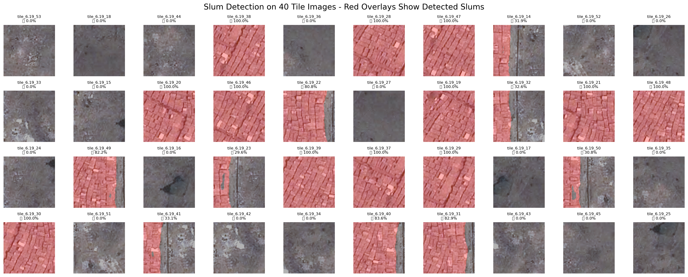
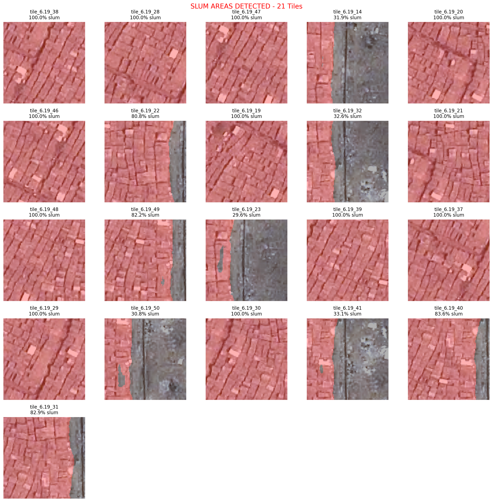
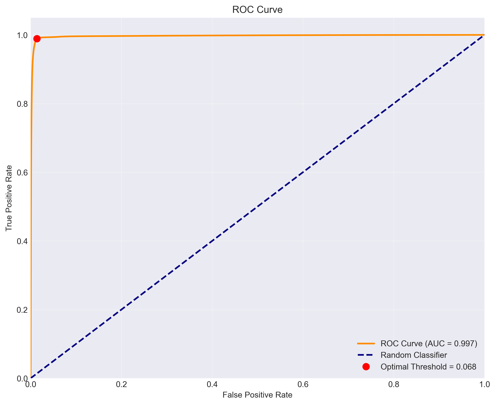
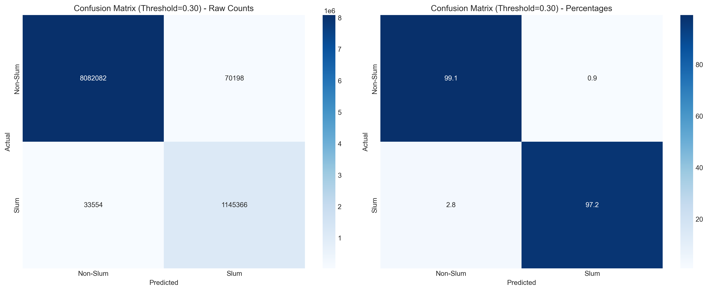
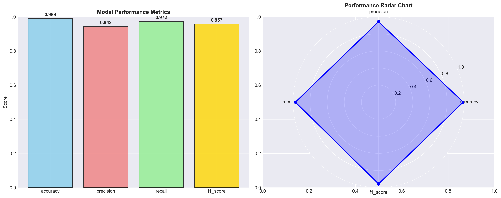
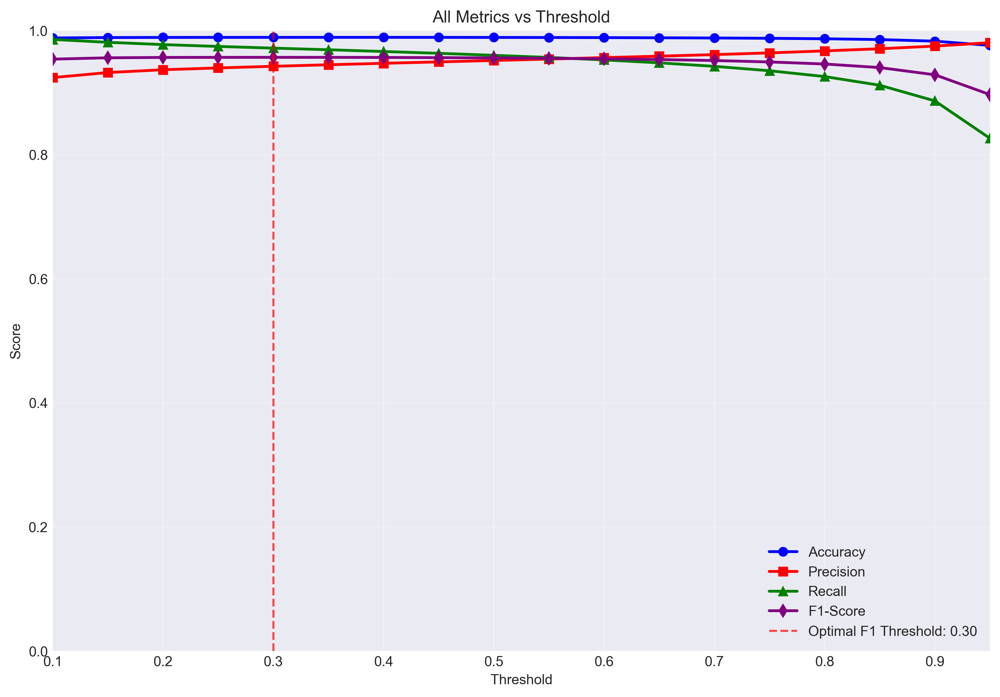
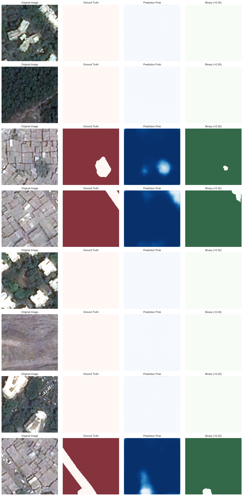

# 🏘️ Slum Detection with UNet


> Semantic segmentation model for detecting slums in 120×120 satellite images using UNet + ResNet34. Achieves 99.67% AUC-ROC with advanced loss functions and strong class imbalance handling.

---

## 🗂️ Additional Results & Visualizations

**Prediction Grids**


**Tile Predictions Grid**


**Slum Detected Tiles**


**Opera Snapshot (Kaggle)**


---

## 📈 Results Overview

**ROC Curve**  


**Confusion Matrix**  


**Performance Summary**  


**Threshold Analysis**  


---

## 🖼️ Sample Predictions



---

## 🔧 Quick Start

```bash
git clone https://github.com/Akila-Wasalathilaka/Slum-detection-model-using-UNET.git
cd Slum-detection-model-using-UNET
pip install -r requirements.txt
python scripts/train.py --model balanced --training development
